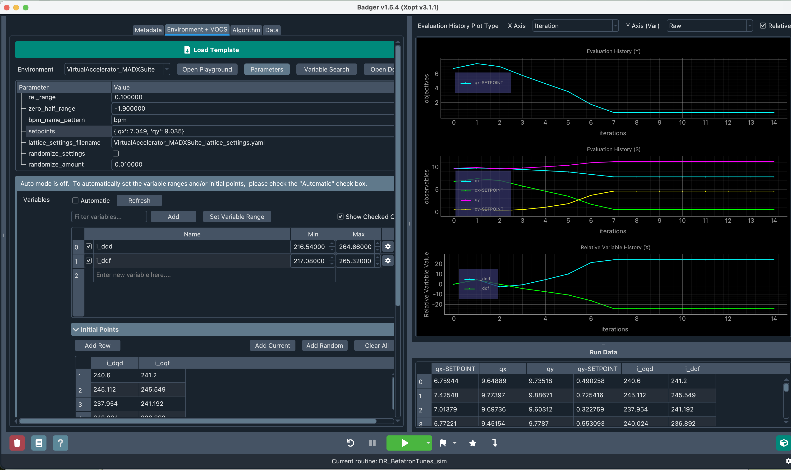
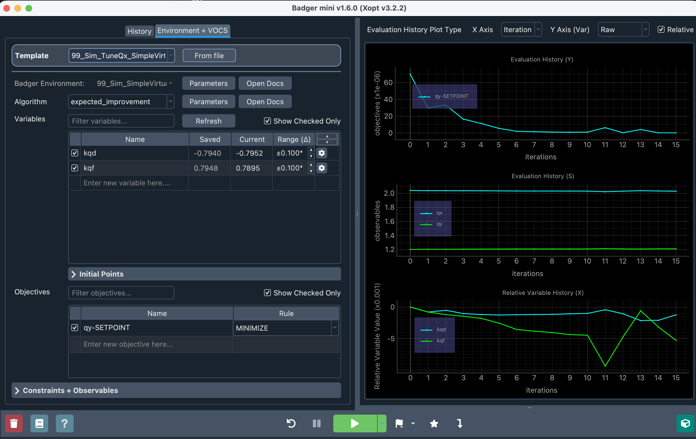

# FermiBadgerPlugins - Use Badger to run Xopt at Fermilab

This repository contains plugins and configurations for using [Badger](https://github.com/xopt-org/Badger) (the Bayesian optimization GUI frontend) with [Xopt](https://github.com/xopt-org/Xopt) at Fermilab. It includes:

- **Tuning templates** - Pre-configured optimization setups for various accelerator tuning tasks
- **VirtualAccelerator tuning** - using lattice files of the physical machines and toy simulations
- **Test script** - `tests/test-quick-start.sh` to verify your installation

<table>
<tr>
<td valign="top">

## Contents

- [Quick Start](#quick-start)
- [Environment Setup Details](#environment-setup-details)
- [First-Time GUI Setup](#first-time-gui-setup)
- [Using the VirtualAccelerator Environment Plugins](#using-the-virtualaccelerator-environment-plugins)
- [Troubleshooting](#troubleshooting)
- [Repository Structure](#repository-structure)
- [For Developers](#for-developers)
- [Related Documentation](#related-documentation)

</td>
<td align="center" width="340">

<code>badger -g</code><br>


<code>badger -mini</code><br>


</td>
</tr>
</table>

## Quick Start

[↑ Back to top](#contents)

### 1. Clone this repository

```bash
git clone git@github.com:fermi-ad/FermiBadgerPlugins.git
cd FermiBadgerPlugins
```

### 2. Run the setup script

**Prerequisite**: You must be on the FNAL private network (on-site or via VPN). The `acsys` package requires access to FNAL's internal pip repository.

```bash
./setup.sh
```

This creates the `FermiBadger_env` conda environment, applies the Badger patches, writes `config.local.yaml`, and verifies the plugin is discoverable — see [Apply patches and configure by hand](#apply-patches-and-configure-by-hand) for what it does under the hood:

1. Creates the `FermiBadger_env` conda environment from `environment.yml`. If an environment of that name already exists, it asks whether to remove and recreate it, use a different name, or keep it as-is.
2. Applies the Badger patches to that environment.
3. Writes `config.local.yaml` with this clone's paths — it works no matter where you cloned the repo, `/tmp` included. Your archive and logbook directories default to `~/BadgerArchive` and `~/BadgerLogs`; press Enter to accept or type your own.
4. Verifies that Badger can discover the plugins.

It is safe to re-run: patches already applied are detected and skipped.

```bash
./setup.sh --help          # options
./setup.sh --yes           # take every default, no prompts
./setup.sh --env-name foo  # different environment name
./setup.sh --skip-env      # patches and config only
./setup.sh --config        # rewrite config.local.yaml only (no env, no patches)
```

### 3. Launch

```bash
conda activate FermiBadger_env
badger -g -cf config.local.yaml
```

Or load a template straight into the compact `-mini` GUI:

```bash
badger -mini -cf config.local.yaml -t Xfer400MeV_example.yaml
```

`config.local.yaml` is gitignored, so the tracked `config.yaml` stays a clean template and `git pull` never conflicts with your local paths.

---

## Environment Setup Details

[↑ Back to top](#contents)

### Conda Environment (`environment.yml`)

The `environment.yml` file defines the complete `FermiBadger_env` environment with:

- **Python**: 3.12.1
- **Badger**: 1.6.0
- **Xopt**: pulled in transitively by `badger-opt=1.6.0` (currently 3.2.2)
- **XSuite packages**: xtrack, xobjects, xfields, xcoll, xsuite
- **cpymad** for MADX
- **FNAL Accelerator Control System packages**: acsys (requires FNAL network), pacsys

### Why Patches Are Required

Badger 1.6.0 has several pydantic rules that affect template loading and the `-mini` variable table for the VirtualAccelerator plugins (which dynamically build lists of variables & observables from lattice files). See [`patches/README.md`](patches/README.md) for the full list of issues and which patch fixes each one.

### Apply patches and configure by hand

`setup.sh` does this for you (Quick Start step 2). Do it by hand only for a non-conda Badger install, or to see the mechanics.

`setup.sh` applies three patches to your `FermiBadger_env` installation of Badger 1.6.0 — fixing template-loading errors, `turbo_controller: null` handling, and the `-mini` variable table — and writes `config.local.yaml` with `BADGER_PLUGIN_ROOT`, `BADGER_TEMPLATE_ROOT`, `BADGER_LOG_DIRECTORY` pointed at this clone, plus your chosen archive/logbook directories.

For the patches, see [`patches/README.md`](patches/README.md) for `patch`/`git apply` walkthroughs. For the config, copy `config.yaml` to `config.local.yaml` (gitignored) and set these to absolute paths, creating each directory if it doesn't exist:

- `BADGER_PLUGIN_ROOT` - the `plugins` directory of this repo
- `BADGER_TEMPLATE_ROOT` - the `tuning_templates` directory of this repo
- `BADGER_LOG_DIRECTORY` - the `logs` directory of this repo
- `BADGER_ARCHIVE_ROOT` and `BADGER_LOGBOOK_ROOT` - where run data and logs go (can be the same, and need not be inside the repo)

### Verifying your installation

Run the test script to verify everything is set up correctly:

```bash
./tests/test-quick-start.sh
```

This script:
- Clones a fresh copy of the repository to `/tmp/FermiBadger_envTEST`
- Creates a new conda environment named `FermiBadger_envTEST`
- Installs the plugin and verifies it's discoverable by Badger

**Note:** The test uses a separate environment (`FermiBadger_envTEST`) to avoid conflicts with your main `FermiBadger_env`.

---

## First-Time GUI Setup

[↑ Back to top](#contents)

Point Badger at a different `plugins`/`tuning_templates`/archive/logbook location later — a second clone, a shared archive drive, a renamed environment — without recreating the conda environment or reapplying patches:

```bash
./setup.sh --config
```

This only rewrites `config.local.yaml`; it asks the same archive/logbook questions as a full `setup.sh` run but skips environment creation and patching entirely.

### Loading a tuning template

Use `File > Open Template` and choose one from `tuning_templates/`. Badger loads the matching Environment and Interface automatically, along with the template's preset variables, objectives, and algorithm settings.

- `99_Sim_TuneQx_SimpleVirtualAccelerator.yaml` - quick-start example (toy simulated storage ring)
- `99_Sim_DR_BetatronTunes_sim_VirtualAccelerator_MADXSuite.yaml` - Delivery Ring tune optimization (MAD-X simulation)
- Templates for physical-system tuning require valid Kerberos credentials and the matching settings role.

---

## Using the VirtualAccelerator Environment Plugins

[↑ Back to top](#contents)

The 99_Sim_VirtualAccelerator_MADXSuite environment:

1. Loads a MAD-X lattice file (specified by `lattice_filename` parameter)
2. Automatically deduces variables (knobs, element attributes) and observables (optics, BPM reads) from element names
3. Uses XSuite for fast re-simulation when variables are changed
4. Supports MAD-X deferred expressions that are re-evaluated on each iteration

### Lattice Files

Lattice files are stored in `sim_configs/`. 

### Configuration Parameters

This simulation-tuning environment accepts these parameters in its tuning templates:

| Parameter | Description |
|-----------|-------------|
| `lattice_filename` | Path to MAD-X lattice file (relative to repo root) |
| `sequence_name` | MAD-X sequence name to use |
| `sequence_name_matched` | Matched sequence name for tuning |
| `rel_range` | Range for auto-deducing variable bounds (default: 0.1) |
| `zero_half_range` | Half-range for zero-valued variables (default: 0.1) |

---

## Troubleshooting

[↑ Back to top](#contents)

### FNAL Network Required

The `acsys` package is hosted on FNAL's internal pip repository (`https://www-bd.fnal.gov/pip3`). You must be on the FNAL network (on-site or VPN) to install it.

**Error if off-network**:
```
ERROR: Could not find a version that satisfies the requirement acsys
```

### libGL.so.1 Missing

On headless systems or some Docker configurations, Badger may fail with:
```
ImportError: libGL.so.1: cannot open shared object file
```

**Fix**:
```bash
conda install -c conda-forge mesa-libgl-cos7-x86_64
# or on Ubuntu/Debian:
sudo apt-get install libgl1-mesa-glx
```

### OMP_NUM_THREADS on EAF

When running on the EAF (Experimental Accelerator Facility), set:
```bash
export OMP_NUM_THREADS=8
```
to prevent slow performance from thread contention.

### Environment Not Found

If `conda activate FermiBadger_env` fails:
```bash
conda env list  # Verify the environment exists
conda create -n FermiBadger_env -f environment.yml  # Recreate if missing
```

### Dict type must have subtypes Error

When loading a template (e.g., `99_Sim_DR_BetatronTunes_sim_VirtualAccelerator_MADXSuite.yaml`), you may see:
```
ValueError: Dict type must have subtypes
```

**Cause:** Badger 1.6.0 has a bug where dict/list environment parameters without type subtypes cause this error.

**Fix:** Apply the patch from `patches/pydantic_editor-badger-1.6.0-dict-subtypes.patch`.

See [`patches/README.md`](patches/README.md) for patch instructions.

---

## Repository Structure

[↑ Back to top](#contents)

```
FermiBadgerPlugins/
├── CLAUDE.md                   # Project context and session history
├── config.yaml                 # Badger configuration
├── docs/                       # Development documentation
│   ├── log.md
│   ├── progress.md
│   └── ...
├── environment.yml             # Conda environment definition
├── patches/                    # Badger bug fixes
│   ├── pydantic_editor-badger-1.6.0-dict-subtypes.patch
│   ├── README.md
│   └── ...
├── plugins/
│   ├── environments/           # Badger Environment plugins (see naming convention below)
│   │   ├── 01_Linac_RIL_tuning_Acsys/
│   │   ├── 09_DeliveryRing_Muon_PID_tune_Acsys/
│   │   ├── 99_Sim_VirtualAccelerator_MADXSuite/
│   │   └── ...
│   └── interfaces/             # Badger Interface plugins
│       └── VirtualAccelerator_MADXSuiteInterface/
├── setup.sh                    # One-command install/patch/config script
├── sim_configs/                # MAD-X lattice files and settings
│   └── DeliveryRing/
├── tests/                      # Diagnostic and verification scripts
│   ├── check_RIL_tuning_live_bounds.py  # Read-only live-bounds diagnostic
│   └── test-quick-start.sh     # Fresh-clone verification script
└── tuning_templates/           # Pre-configured optimization setups (see naming convention below)
    ├── 99_Sim_DR_BetatronTunes_sim_VirtualAccelerator_MADXSuite.yaml
    └── 99_Sim_Xfer400MeV_example_VirtualAccelerator_MADXSuite.yaml
```

---

## For Developers

[↑ Back to top](#contents)

### Environment and template naming convention

`plugins/environments/*` folders and `tuning_templates/*.yaml` files are named so they alpha-sort in the Badger GUI's picker in physical beam order, not plain alphabetical order:

```
<region>_<Descriptive>[_Acsys|_Pacsys]
```

`<region>` is a zero-padded two-digit code, chosen so digit-first names sort ahead of any unprefixed legacy name and leave room to insert new regions later without renumbering:

| Code | Region |
|------|--------|
| `01` | Linac |
| `02` | Xfer400MeV |
| `03` | Booster |
| `04` | BoosterNuStub |
| `05` | Xfer8GeV |
| `06` | MIRR (Main Injector/Recycler Ring) |
| `07` | NuMIStub |
| `08` | P1toDR (the P1+P2+M1+M2/3 extraction line to the Delivery Ring) |
| `09` | DeliveryRing |
| `10` | MuonCampus |
| `99` | Sim (simulation environments — always sorts last, regardless of how many real regions exist) |

Every real-machine environment (backed by an actual control-system interface, not a simulation) carries an explicit `_Acsys` or `_Pacsys` suffix naming which control system it talks to — even when only one variant currently exists, so the interface choice stays visible to the next developer ahead of the day a second variant needs picking. Drop any part of the descriptive name that would otherwise just repeat the region name (e.g. `LinacQuadTuning` under `01_Linac` becomes `01_Linac_QuadTuning_Acsys`, not `01_Linac_LinacQuadTuning_Acsys`).

A tuning template's filename follows its own token order, `<region>_<tuning_task>_<env_plugin>[_Acsys|_Pacsys]`, so templates still group and sort by region the same way the environment picker does, while leading with the descriptive part instead of repeating the full environment name up front:

```
01_Linac_trims_and_sol_RIL_tuning_Acsys.yaml
```

Here `01_Linac` is the region code, `trims_and_sol` is the tuning task, `RIL_tuning` is the `env_plugin` (the parent environment's own name, with its region prefix and interface suffix stripped — i.e. `01_Linac_RIL_tuning_Acsys` minus `01_Linac_` and `_Acsys`), and `Acsys` is the interface suffix. Simulation templates omit the interface suffix, since their parent sim environments don't carry one either, e.g. `99_Sim_TuneQx_SimpleVirtualAccelerator.yaml`.

When a region assignment is ambiguous — an environment that varies a parameter in one region but reads a diagnostic from another — ask before guessing; Fermilab device-prefix meanings require domain knowledge.

**Gotcha:** `badger.factory.load_plugin` loads environment modules via `importlib.import_module(f"environments.{name}")`, which works fine with digit-leading folder names. But a literal `from environments.01_Linac_RIL_tuning_Acsys import X` is a `SyntaxError` — any ad hoc script or test that needs to import a renamed environment module directly must use `importlib.import_module(...)` instead (see `tests/VA_deferred_expressions_test.py` and `tests/VA_plugin_smoke_test.py` for the pattern).

---

## Related Documentation

[↑ Back to top](#contents)

- [CLAUDE.md](CLAUDE.md) - Project overview and standards
- [HANDOFF.md](HANDOFF.md) - Developer handoff guide with critical gotchas
- [docs/progress.md](docs/progress.md) - Current development status
- [docs/log.md](docs/log.md) - Session history
