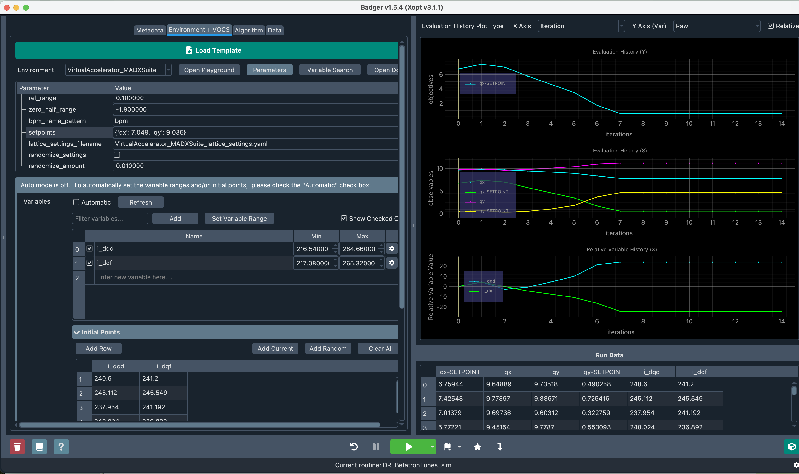
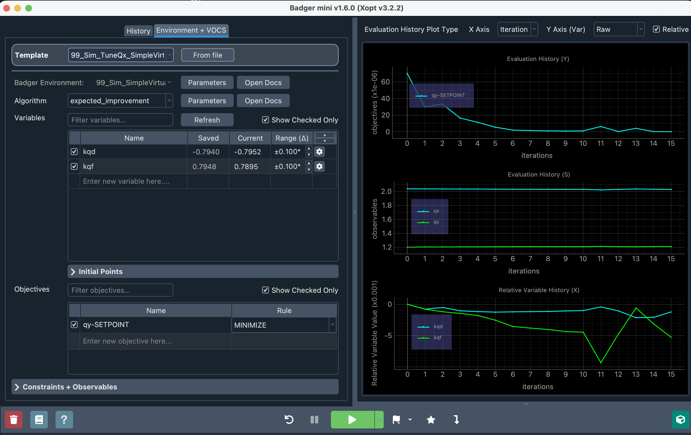

# FermiBadgerPlugins - Use Badger to run Xopt at Fermilab

This repository contains plugins and configurations for using [Badger](https://github.com/xopt-org/Badger) (the Bayesian optimization GUI frontend) with [Xopt](https://github.com/xopt-org/Xopt) at Fermilab. It includes:

- **Tuning templates** - Pre-configured optimization setups for various accelerator tuning tasks
- **VirtualAccelerator tuning** - using lattice files of the physical machines and toy simulations
- **Test script** - `tests/test-quick-start.sh` to verify your installation

<table>
<tr>
<td valign="top">

## Contents

- [Quick Start](#quick-start)
- [Environment Setup Details](#environment-setup-details)
- [First-Time GUI Setup](#first-time-gui-setup)
- [Using the VirtualAccelerator Environment Plugins](#using-the-virtualaccelerator-environment-plugins)
- [Troubleshooting](#troubleshooting)
- [Repository Structure](#repository-structure)
- [For Developers](#for-developers)
- [Related Documentation](#related-documentation)

</td>
<td align="center" width="340">

<code>badger -g</code><br>


<code>badger -mini</code><br>


</td>
</tr>
</table>

## Quick Start

[↑ Back to top](#contents)

### 1. Clone this repository

```bash
git clone git@github.com:fermi-ad/FermiBadgerPlugins.git
cd FermiBadgerPlugins
```

### 2. Run the setup script

**Prerequisite**: You must be on the FNAL private network (on-site or via VPN). The `acsys` package requires access to FNAL's internal pip repository.

```bash
./setup.sh
```

This creates the `FermiBadger_env` conda environment, applies the Badger patches, writes `config.local.yaml`, and verifies the plugin is discoverable — see [Apply patches and configure by hand](#apply-patches-and-configure-by-hand) for what it does under the hood:

1. Creates the `FermiBadger_env` conda environment from `environment.yml`. If an environment of that name already exists, it asks whether to remove and recreate it, use a different name, or keep it as-is.
2. Applies the Badger patches to that environment.
3. Writes `config.local.yaml` with this clone's paths — it works no matter where you cloned the repo, `/tmp` included. Your archive and logbook directories default to `~/BadgerArchive` and `~/BadgerLogs`; press Enter to accept or type your own.
4. Verifies that Badger can discover the plugins.

It is safe to re-run: patches already applied are detected and skipped.

```bash
./setup.sh --help          # options
./setup.sh --yes           # take every default, no prompts
./setup.sh --env-name foo  # different environment name
./setup.sh --skip-env      # patches and config only
./setup.sh --config        # rewrite config.local.yaml only (no env, no patches)
```

### 3. Launch

```bash
conda activate FermiBadger_env
badger -g -cf config.local.yaml
```

Or load a template straight into either GUI (the name is relative to `tuning_templates/`):

```bash
badger -g -cf config.local.yaml -t 01_Linac_RIL_tuning.yaml
badger -mini -cf config.local.yaml -t simulation/Xfer400MeV_example_VirtualAccelerator_MADXSuite.yaml
```

`config.local.yaml` is gitignored, so the tracked `config.yaml` stays a clean template and `git pull` never conflicts with your local paths.

---

## Environment Setup Details

[↑ Back to top](#contents)

### Conda Environment (`environment.yml`)

The `environment.yml` file defines the complete `FermiBadger_env` environment with:

- **Python**: 3.12.1
- **Badger**: 1.6.0
- **Xopt**: pulled in transitively by `badger-opt=1.6.0` (currently 3.2.2)
- **XSuite packages**: xtrack, xobjects, xfields, xcoll, xsuite
- **cpymad** for MADX
- **FNAL Accelerator Control System packages**: acsys (requires FNAL network), pacsys

### Why Patches Are Required

Badger 1.6.0 has several pydantic rules that affect template loading and the `-mini` variable table for the VirtualAccelerator plugins (which dynamically build lists of variables & observables from lattice files). See [`patches/README.md`](patches/README.md) for the full list of issues and which patch fixes each one.

### Apply patches and configure by hand

`setup.sh` does this for you (Quick Start step 2). Do it by hand only for a non-conda Badger install, or to see the mechanics.

`setup.sh` applies three patches to your `FermiBadger_env` installation of Badger 1.6.0 — fixing template-loading errors, `turbo_controller: null` handling, and the `-mini` variable table — and writes `config.local.yaml` with `BADGER_PLUGIN_ROOT`, `BADGER_TEMPLATE_ROOT`, `BADGER_LOG_DIRECTORY` pointed at this clone, plus your chosen archive/logbook directories.

For the patches, see [`patches/README.md`](patches/README.md) for `patch`/`git apply` walkthroughs. For the config, copy `config.yaml` to `config.local.yaml` (gitignored) and set these to absolute paths, creating each directory if it doesn't exist:

- `BADGER_PLUGIN_ROOT` - the `plugins` directory of this repo
- `BADGER_TEMPLATE_ROOT` - the `tuning_templates` directory of this repo
- `BADGER_LOG_DIRECTORY` - the `logs` directory of this repo
- `BADGER_ARCHIVE_ROOT` and `BADGER_LOGBOOK_ROOT` - where run data and logs go (can be the same, and need not be inside the repo)

### Verifying your installation

Run the test script to verify everything is set up correctly:

```bash
./tests/test-quick-start.sh
```

This script:
- Clones a fresh copy of the repository to `/tmp/FermiBadger_envTEST`
- Creates a new conda environment named `FermiBadger_envTEST`
- Installs the plugin and verifies it's discoverable by Badger

**Note:** The test uses a separate environment (`FermiBadger_envTEST`) to avoid conflicts with your main `FermiBadger_env`.

---

## First-Time GUI Setup

[↑ Back to top](#contents)

Point Badger at a different `plugins`/`tuning_templates`/archive/logbook location later — a second clone, a shared archive drive, a renamed environment — without recreating the conda environment or reapplying patches:

```bash
./setup.sh --config
```

This only rewrites `config.local.yaml`; it asks the same archive/logbook questions as a full `setup.sh` run but skips environment creation and patching entirely.

### Loading a tuning template

Use `File > Open Template` and choose one from `tuning_templates/`. Badger loads the matching Environment and Interface automatically, along with the template's preset variables, objectives, and algorithm settings.

- Top level of `tuning_templates/` holds the operations-ready physical-machine templates (currently `01_Linac_RIL_tuning.yaml`). These are the only ones the `-mini` GUI's template dropdown lists; the full GUI's file dialog can browse into the subdirectories.
- `tuning_templates/development/` - physical-machine templates still being worked on. They require valid Kerberos credentials and the matching settings role.
- `tuning_templates/simulation/` - simulation templates, no credentials needed:
  - `TuneQx_SimpleVirtualAccelerator.yaml` - quick-start example (toy simulated storage ring)
  - `DR_BetatronTunes_sim_VirtualAccelerator_MADXSuite.yaml` - Delivery Ring tune optimization (MAD-X simulation)

---

## Using the VirtualAccelerator Environment Plugins

[↑ Back to top](#contents)

The 99_Sim_VirtualAccelerator_MADXSuite environment:

1. Loads a MAD-X lattice file (specified by `lattice_filename` parameter)
2. Automatically deduces variables (knobs, element attributes) and observables (optics, BPM reads) from element names
3. Uses XSuite for fast re-simulation when variables are changed
4. Supports MAD-X deferred expressions that are re-evaluated on each iteration

### Lattice Files

Lattice files are stored in `sim_configs/`. 

### Configuration Parameters

This simulation-tuning environment accepts these parameters in its tuning templates:

| Parameter | Description |
|-----------|-------------|
| `lattice_filename` | Path to MAD-X lattice file (relative to repo root) |
| `sequence_name` | MAD-X sequence name to use |
| `sequence_name_matched` | Matched sequence name for tuning |
| `rel_range` | Range for auto-deducing variable bounds (default: 0.1) |
| `zero_half_range` | Half-range for zero-valued variables (default: 0.1) |

---

## Troubleshooting

[↑ Back to top](#contents)

### FNAL Network Required

The `acsys` package is hosted on FNAL's internal pip repository (`https://www-bd.fnal.gov/pip3`). You must be on the FNAL network (on-site or VPN) to install it.

**Error if off-network**:
```
ERROR: Could not find a version that satisfies the requirement acsys
```

### libGL.so.1 Missing

On headless systems or some Docker configurations, Badger may fail with:
```
ImportError: libGL.so.1: cannot open shared object file
```

**Fix**:
```bash
conda install -c conda-forge mesa-libgl-cos7-x86_64
# or on Ubuntu/Debian:
sudo apt-get install libgl1-mesa-glx
```

### OMP_NUM_THREADS on EAF

When running on the EAF (Experimental Accelerator Facility), set:
```bash
export OMP_NUM_THREADS=8
```
to prevent slow performance from thread contention.

### Environment Not Found

If `conda activate FermiBadger_env` fails:
```bash
conda env list  # Verify the environment exists
conda create -n FermiBadger_env -f environment.yml  # Recreate if missing
```

### Dict type must have subtypes Error

When loading a template (e.g., `simulation/DR_BetatronTunes_sim_VirtualAccelerator_MADXSuite.yaml`), you may see:
```
ValueError: Dict type must have subtypes
```

**Cause:** Badger 1.6.0 has a bug where dict/list environment parameters without type subtypes cause this error.

**Fix:** Apply the patch from `patches/pydantic_editor-badger-1.6.0-dict-subtypes.patch`.

See [`patches/README.md`](patches/README.md) for patch instructions.

---

## Repository Structure

[↑ Back to top](#contents)

```
FermiBadgerPlugins/
├── CLAUDE.md                   # Project context and session history
├── config.yaml                 # Badger configuration
├── docs/                       # Development documentation
│   ├── log.md
│   ├── progress.md
│   └── ...
├── environment.yml             # Conda environment definition
├── patches/                    # Badger bug fixes, applied by setup.sh in the order patches/README.md lists
│   ├── pydantic_editor-badger-1.6.0-dict-subtypes.patch
│   ├── badger-mini-config.patch
│   ├── badger-mini-var-table-env-configs.patch
│   ├── badger-1.6.0-device-list-gui.patch
│   ├── badger-1.6.0-full-gui-template-option.patch
│   ├── xopt-3.2.2-turbo-serialization.patch
│   └── README.md
├── plugins/
│   ├── environments/           # Badger Environment plugins (see naming convention below)
│   │   ├── 01_Linac_RIL_tuning_Acsys/
│   │   ├── 09_DeliveryRing_Muon_PID_tune_Acsys/
│   │   ├── 99_Sim_VirtualAccelerator_MADXSuite/
│   │   └── ...
│   └── interfaces/             # Badger Interface plugins
│       └── VirtualAccelerator_MADXSuiteInterface/
├── setup.sh                    # One-command install/patch/config script
├── sim_configs/                # MAD-X lattice files and settings
│   └── DeliveryRing/
├── tests/                      # Diagnostic and verification scripts
│   ├── check_RIL_tuning_live_bounds.py  # Read-only live-bounds diagnostic
│   ├── template_lint_test.py   # Headless check that every tuning template loads
│   └── test-quick-start.sh     # Fresh-clone verification script
└── tuning_templates/           # Pre-configured optimization setups (see naming convention below)
    ├── 01_Linac_RIL_tuning.yaml            # operations-ready physical-machine templates live at the top level
    ├── development/                        # physical-machine templates still being worked on
    │   ├── 01_Linac_OutputTrajectory_RIL_tuning_Acsys.yaml
    │   └── ...
    └── simulation/                         # simulation templates (no 99_Sim_ prefix: the directory says it)
        ├── DR_BetatronTunes_sim_VirtualAccelerator_MADXSuite.yaml
        ├── Xfer400MeV_example_VirtualAccelerator_MADXSuite.yaml
        └── ...
```

---

## For Developers

[↑ Back to top](#contents)

### Environment and template naming convention

`plugins/environments/*` folders and `tuning_templates/*.yaml` files are named so they alpha-sort in the Badger GUI's picker in physical beam order, not plain alphabetical order:

```
<region>_<Descriptive>[_Acsys|_Pacsys]
```

`<region>` is a zero-padded two-digit code, chosen so digit-first names sort ahead of any unprefixed legacy name and leave room to insert new regions later without renumbering:

| Code | Region |
|------|--------|
| `01` | Linac |
| `02` | Xfer400MeV |
| `03` | Booster |
| `04` | BNB (Booster Neutrino Beam line) |
| `05` | Xfer8GeV |
| `06` | MIRR (Main Injector/Recycler Ring) |
| `07` | NuMI |
| `08` | P1toDR (the P1+P2+M1+M2/3 extraction line to the Delivery Ring) |
| `09` | DeliveryRing |
| `10` | MuonCampus |
| `99` | Sim (simulation environments — always sorts last, regardless of how many real regions exist) |

Every real-machine environment (backed by an actual control-system interface, not a simulation) carries an explicit `_Acsys` or `_Pacsys` suffix naming which control system it talks to — even when only one variant currently exists, so the interface choice stays visible to the next developer. Drop any part of the descriptive name that would otherwise just repeat the region name (e.g. `LinacQuadTuning` under `01_Linac` becomes `01_Linac_QuadTuning_Acsys`, not `01_Linac_LinacQuadTuning_Acsys`).

A tuning template's filename follows its own token order, `<region>_<tuning_task>_<env_plugin>[_Acsys|_Pacsys]`, so templates still group and sort by region the same way the environment picker does, while leading with the descriptive part instead of repeating the full environment name up front:

```
01_Linac_OutputTrajectory_RIL_tuning_Acsys.yaml
```

Here `01_Linac` is the region code, `OutputTrajectory` is the tuning task, `RIL_tuning` is the `env_plugin` (the parent environment's own name, with its region prefix and interface suffix stripped — i.e. `01_Linac_RIL_tuning_Acsys` minus `01_Linac_` and `_Acsys`), and `Acsys` is the interface suffix. Simulation templates live in `tuning_templates/simulation/` and drop the `99_Sim_` region prefix as well as the interface suffix (their parent sim environments keep the prefix, since they share one picker with the real-machine environments), e.g. `simulation/TuneQx_SimpleVirtualAccelerator.yaml`. Physical-machine templates go in `tuning_templates/development/` until they are ready for operations, then move to the top level, which is the only level the `-mini` dropdown lists. Top-level templates also drop the `_Acsys`/`_Pacsys` suffix (e.g. `01_Linac_RIL_tuning.yaml`): operators need not know which control-system interface the template's environment uses, and the `environment.name` inside the file still records it. An environment's general-purpose template is named after the environment alone, e.g. `development/01_Linac_RIL_tuning_Pacsys.yaml`; it checks the recommended default selection, and the operator reaches the narrower setups by unchecking variables in the GUI rather than by picking a different template.

When a region assignment is ambiguous — e.g. an environment that varies a parameter in one region but reads a diagnostic from another — ask before guessing; Fermilab device-prefix meanings require domain knowledge.

**Gotcha:** `badger.factory.load_plugin` loads environment modules via `importlib.import_module(f"environments.{name}")`, which works fine with digit-leading folder names. But a literal `from environments.01_Linac_RIL_tuning_Acsys import X` is a `SyntaxError` — any ad hoc script or test that needs to import a renamed environment module directly must use `importlib.import_module(...)` instead (see `tests/VA_deferred_expressions_test.py` and `tests/VA_plugin_smoke_test.py` for the pattern).

---

### Periodic (phase) devices

A phase in degrees or radians is the same physics at `x` and `x + n*period`, and the setting devices accept values past the wrap. Two things make Badger handle that:

- **Declare the environment bounds wide.** Badger's `set_variables` bounds check and the GUI's auto-window clipping both use the environment's `variables` bounds, so a phase variable is declared two periods wide, e.g. `[0., 720.]`, and the template's window is `limit_option_idx: 2` with a `delta` in degrees. See `01_Linac_EnergyStabilization_*`. The exception is a phase with a deliberate operating window well away from the wrap (`L:RFQPAH`, `L:RFBPAH`, `L:V5QSET` in `01_Linac_RIL_tuning_*`): it keeps its tight hard limits, and the `get_variables` unwrap below is enough to bring a readback reported on the other branch (say `-179` for `181`) back inside them.
- **Give the environment a `periods` parameter** (`{reading device: period}`, e.g. `{'L:CDPHAS': 360.0}`) and pass it to the interface's `get_values`/`set_values`. Readbacks of those devices are unwrapped (`plugins/periodic.py`) onto the branch nearest the first reading of the run, or nearest the setpoint for a `-SETPOINT` device, so a wrap through 0 never shows up as a full-period jump in an objective, a constraint, or the settle-to-tolerance loop. `get_variables` additionally keeps the current value near the middle of the declared bounds so a window around it never straddles a bound.

Offline check: `python tests/periodic_phase_test.py`.

### Trim magnets that share a bulk power supply

Per-variable bounds cannot stop several trims on one bulk supply from together drawing more than the supply can source. An environment declares the groups and their ratings as two template-overridable parameters, `supply_groups` (`{group: 'DEV1,DEV2,...'}` of setting devices) and `supply_limits` (`{group: max sum |I| in amps}`), and calls `clip_to_supply_limits` (`plugins/supply_limits.py`) in `set_variables` before writing. Members not being set count at their live setting. If the sum would exceed the limit, the largest |I| being set is reduced (to zero, then the next largest) until it fits, with a one-line console warning; if the members *not* being set already exceed the limit on their own, the write is refused with `BadgerEnvVarError`. Each group's sum is also offered as the observable `SumAbs_<group>` (listed in the environment's `observables`), so a template can add a `LessThanConstraint` on it and the optimizer learns to stay clear of the clip. See `01_Linac_RIL_tuning_*` (source A, source B, MEBT Q1 and MEBT Q2 trims each on their own supply) and the `SumAbs_SourceATrims` constraint in `tuning_templates/01_Linac_RIL_tuning.yaml`.

Offline check: `python tests/supply_limits_test.py`.

### Averaged observables (Pacsys environments only)

An environment can declare `average_events: {reading device or 'default': N}` (see `01_Linac_RIL_tuning_Pacsys`). For N > 1 the interface opens a temporary subscription with pacsys's `read_fresh`, collects N events of that device's `sample_events` event and returns their mean, so an objective is smoother at the cost of N machine cycles per evaluation. N > 1 needs a streaming event; `@i` raises at read time. Templates override it like any other environment parameter.

### Array observables: `<DRF>|<reduce>` (Pacsys environments only)

An observable named `B:BPMARR[0:40]|rms` reads the (optionally ranged) array DRF and returns one number. Reductions: `mean`, `rms`, `std`, `min`, `max`, `sum`, `absmax`; anything else is rejected at read time, and a reduction on a scalar device is an error rather than a pass-through. Combine with `average_events` to get the mean of per-event reductions. Not combinable with `-SETPOINT` or read/set pairs.

### Mults: console-style fixed-proportion knobs (RIL environments)

A parameter-page "mult" moves several settings together from their as-found values in fixed proportion. Both RIL environments declare them as `mults: {name: 'DEV*coeff,DEV*coeff,...'}` plus `mult_step_size: {name: size}`, and each one is a Badger variable named `mult:<name>` whose value is the knob's integer step count (bounds ±10; Badger proposes a float, the environment rounds to the nearest step and reports the integer back). Every member is written as

```
setting = as_found + coefficient × mult_step_size × steps
```

As-found settings are read once per run, on the first touch of any mult. A member that would leave its own hard bounds is clipped, not refused, and the fraction of the requested step lost to clipping is the observable `MultOOB_<name>` (0 good, 1 = that member could not move at all); the production template constrains both to `< 0.5` so a clipped step counts as infeasible and the plots show when the optimum wants to go past a quad's bounds. Ticking a member quad and its mult in the same run is a configuration error. Operators adjust a step size in the GUI's environment parameters before a run. The MEBT quad mults use coefficient 20.0 and step size 0.05, so one step moves each quad of a pair by 1.0 A.

Offline check: `python tests/mults_test.py`.

### Settings verification (Pacsys interface)

`BasicPacsysInterface.set_values` raises if DPM rejects any setting (Badger then stops the run rather than continuing with the machine in an unknown state), reads back a bare device's stored `SETTING` and warns on a mismatch, and gives the read/set-pair settle loop (`tolN@T`) a deadline. A pair such as `L:CDPHAS,L:LDPADJ` is verified by its *reading* device settling, never by comparing the reading to the value sent: they are different physical quantities. `python tests/pacsys_drf_lint_test.py` checks every `*_Pacsys` environment's DRFs offline; `python tests/pacsys_interface_test.py` covers all of the above against `pacsys.testing.FakeBackend`.

## Related Documentation

[↑ Back to top](#contents)

- [CLAUDE.md](CLAUDE.md) - Project overview and standards
- [HANDOFF.md](HANDOFF.md) - Developer handoff guide with critical gotchas
- [docs/progress.md](docs/progress.md) - Current development status
- [docs/log.md](docs/log.md) - Session history
